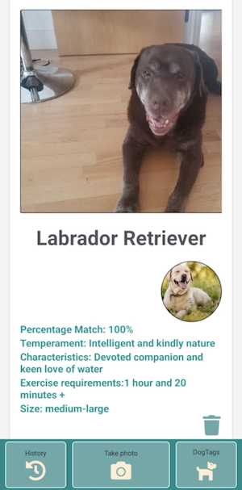
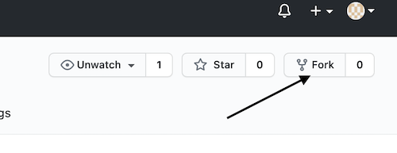

# DogTags

## Description

This was a project between [Sam-Jaya](https://github.com/Sam-Jaya), [lkelsall](https://github.com/lkelsall), [Fieldy618](https://github.com/Fieldy618) and [paulor26](https://github.com/PaulOR26).

The aim was to build a mobile app that uses machine learning technology to identify a dog breed from a photo of the dog. The app also stores a history of the user's dog cards.

## Technologies

The front-end application was created using React Native / Expo.

The machine learning capability was accomplished with Tensorflow JS.

The back-end API was created using Express JS.

[Click here to view the API repo.](https://github.com/PaulOR26/dog-breed-api/blob/main/README.md)

[Click here to view the hosted API.](https://dog-identifier-api.herokuapp.com/api)

MongoDB and Mongo Atlas Cloud were used for the database.

## Our process for developing the project included:

- Spiking technologies to find what would best suit our needs

- Creating user stories based on our MVP

- Incorporating agile practices such as daily stand-ups and pair/mob programming

## Setup

- **Fork** this repo  
  

- **Clone** to your local machine  
  `git clone https://github.com/PaulOR26/dog-breed-identifier.git`

- **Install** dependencies  
  `npm install`

- **Install** Expo mobile app and **Run**

  `expo start`

## Requirements

- **Node.js** v16.3.0
